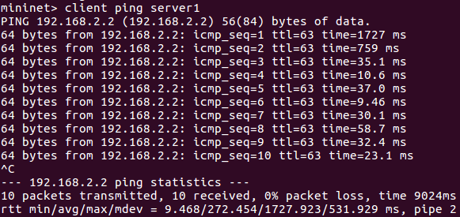
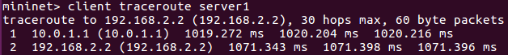
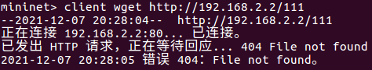

# **Lab 2: Router**

孙梓健  2017010428  软81班

## 1 实验目的

+ 掌握路由器的工作原理
+ 了解以太帧、ARP数据包、IPv4数据报和ICMP报文的结构
+ 熟悉各种数据包的操作方法

## 2 实验环境

+ 操作系统：Ubuntu 16.04.7
+ 编译平台：Visual Studio Code & g++ 5.4.0

## 3 项目流程

### 3.1 数据包处理

对于每种数据包，先从大小、类型、校验和等属性判断其合法性，再按照其类型的不同分别进行处理。

1. 以太帧：分为IPv4包和ARP包
2. ARP包：分为request和reply
    + request：如果目的IP是本路由的IP，发送reply，否则忽略
    + reply：查找arp cache中是否目的地址有对应的IP/MAC对，如果有，对相应的包执行handlePacket，否则将IP/MAC对加入arp cache
3. IPv4：分为指向本路由的包和指向其他路由的包
    + 指向本路由：分为ICMP包和TCP&UDP包，如果是后者，返回响应消息Port Unreachable
    + 指向其他路由：如果TTL为1，判定为超时，返回响应消息Time Exceeded，否则进行转发
4. ICMP：查找arp cache中是否目的地址有对应的IP/MAC对，如果有，返回reply，否则将request加入arp cache

### 3.2 ARP Cache

1. 记录发送次数为5的request，对于这些request，返回响应消息Host Unreachable，对于其他request，发送arp request
2. 删除发送超过5次的request
3. 删除invalid的cache entry

## 4 实验结果

### 4.1 ping

### 4.2 traceroute

### 4.3 wget

ps：我也不知道有什么文件

### 4.4 autograde

## 5 问题总结

1. 在periodicCheckArpRequestsAndCacheEntries函数中使用了std::mutex，导致经常出现死锁现象。了解到std::recursive_mutex允许同一个线程对互斥量对象获取多级所有权，将arp_cache.cpp文件中的所有std::mutex改成std::recursive_mutex之后得到解决。
2. 对代码框架阅读不熟悉，在获取以太帧类型的时候，调用了ethertype之后对type进行了二次顺序码转换，导致ARP和IPv4的类型判断错误。
3. 检查ICMP报文校验和的时候，没有正确理解cksum函数，以为校验和应该是针对整个包。实际上应该减去以太帧和IP包头大小。
4. 查找arp entry有时会错误地没有找到对象，导致ping卡死，原因是在某些地方调用queueRequest函数时，将源IP和目的IP混淆，修改正确即可。

## 6 实验感想

通过本次实验，我增加了对路由器工作原理的了解，对以太帧、ARP、IPv4、ICMP等数据包和协议的理解更加深入，在了解这些协议的基础上，更加熟悉了网络的五层结构和数据的传输流程。